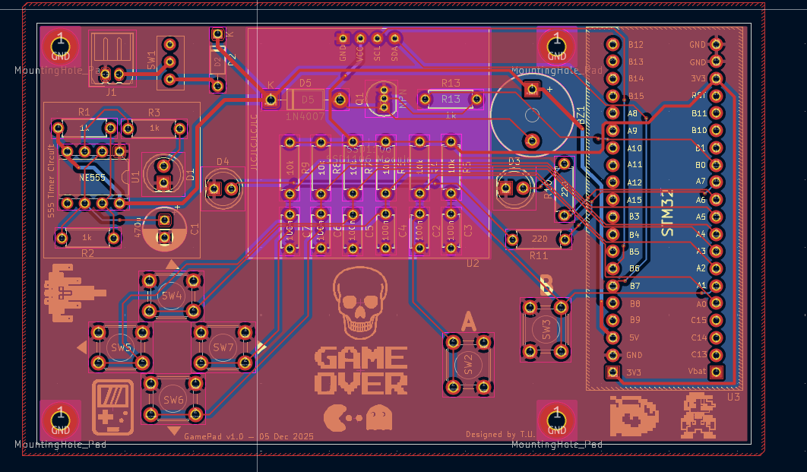
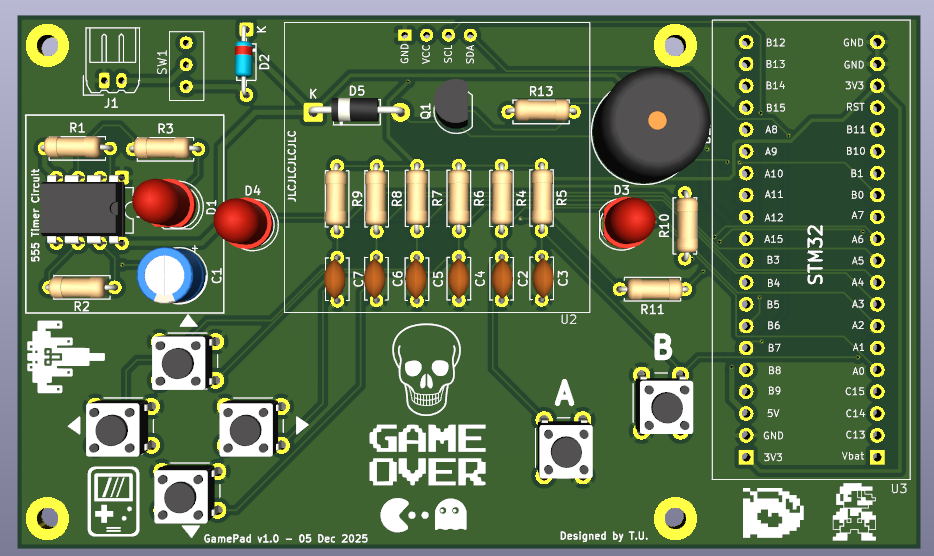
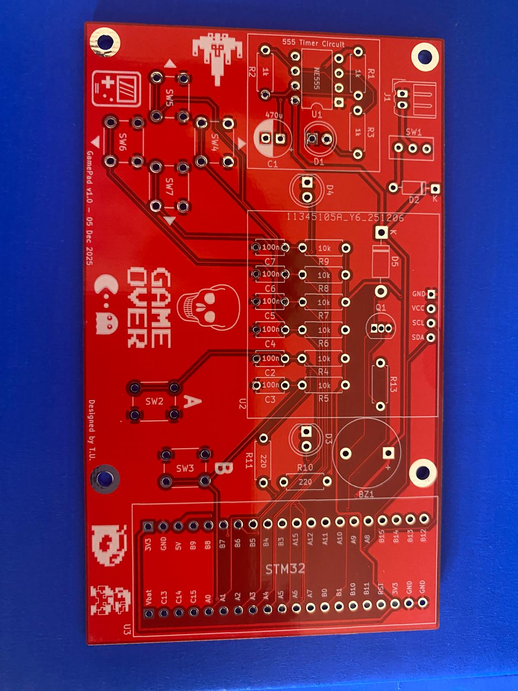
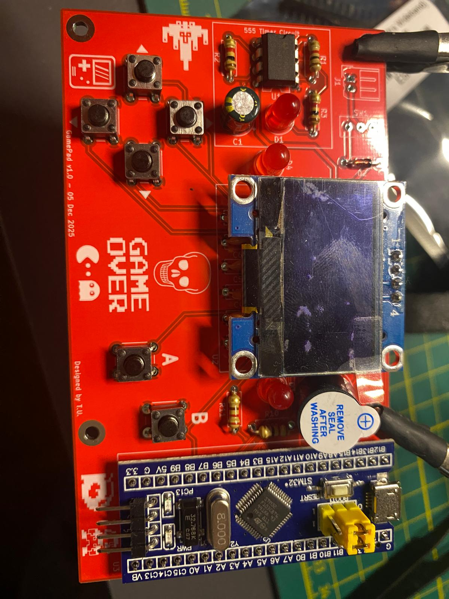
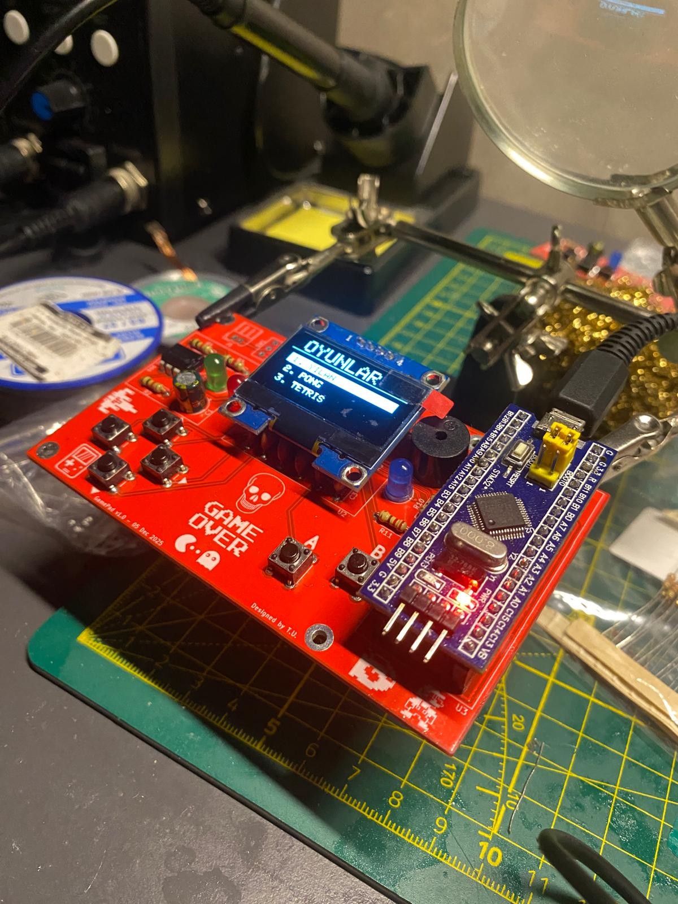
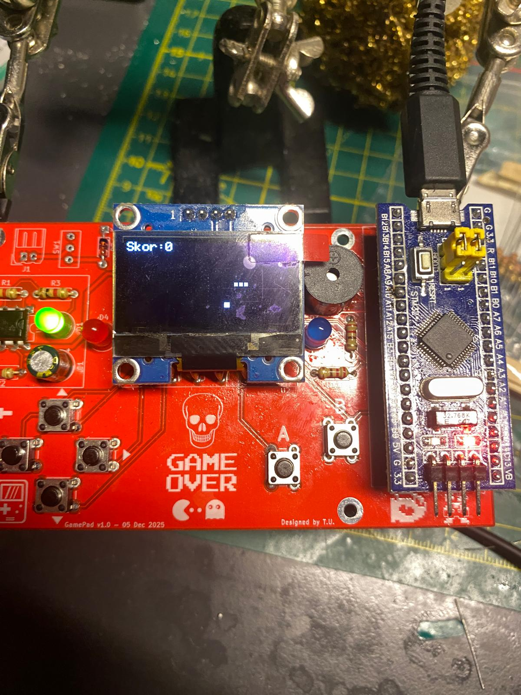

# Game-Console
STM32 based game console PCB design with OLED display, buttons, buzzer, and 555 timer circuit.

# STM32 Game Console PCB Design

This repository contains my custom STM32-based mini game console PCB project designed with KiCad.

The project was developed as a compact embedded system board that combines an STM32 microcontroller module, OLED display, push buttons, buzzer, LEDs, and a 555 timer circuit on a custom PCB.

---

## Project Overview

The main purpose of this project was to design and build a small game console / gamepad-style embedded system board.

The board includes directional buttons, A/B action buttons, an OLED display for menu and game output, a buzzer for sound feedback, LEDs for visual indicators, and an STM32 module as the main controller.

The PCB was designed in KiCad, manufactured as a custom red PCB, assembled with through-hole and module-based components, and tested as a functional hardware prototype.

---

## PCB Layout

The PCB layout was created in KiCad.

The design includes the STM32 module on the right side, user control buttons on the left and bottom sections, an OLED display area, buzzer, LED indicators, and a separate 555 timer circuit section.

---

## 3D PCB View

The 3D view was used to check the physical placement of the components before manufacturing.

This step helped verify the button positions, display area, STM32 module placement, buzzer location, mounting holes, and overall board appearance.

---

## Manufactured PCB

After completing the PCB design, the board was manufactured with a red solder mask.

The silkscreen includes component references, button labels, STM32 pin names, and custom graphics such as the “Game Over” text, skull icon, and pixel-style game icons.

---

## Assembled Prototype

The components were soldered onto the manufactured PCB, including the STM32 module, OLED display, buzzer, LEDs, push buttons, resistors, capacitors, diodes, and 555 timer circuit components.

---

## OLED Menu Test

The OLED display was tested with a simple menu interface.

The menu includes different options such as starting the game, Pong mode, and Tetris mode.

---

## Game Test

The board was also tested with a basic game screen.

The OLED display shows a score value and simple game objects, while the push buttons are used as user controls.

---

## Main Features

- STM32-based mini game console board
- OLED display interface
- Directional control buttons
- A and B action buttons
- Buzzer for sound output
- LED indicators
- 555 timer circuit section
- Custom PCB design
- Manufactured and assembled hardware prototype
- Menu interface and basic game screen test

---

## Main Components

- STM32 microcontroller module
- OLED display module
- Push buttons
- Buzzer
- LEDs
- NE555 timer IC
- Resistors
- Capacitors
- Diodes
- Pin headers
- Custom PCB

---

## Working Principle

The STM32 module acts as the main controller of the system.

The push buttons are used as digital inputs for menu navigation and game control. The OLED display provides visual output such as menu options, score, and game graphics.

The buzzer is used for sound feedback, while LEDs provide visual status indication. The 555 timer circuit section was added as an additional timing / signal generation block on the board.

This project demonstrates how a microcontroller, display, buttons, and basic output components can be combined on a custom PCB to create a small interactive embedded system.

---

## What I Learned

Through this project, I gained practical experience in:

- Designing a custom STM32-based PCB
- Creating a gamepad-style embedded system board
- Using KiCad for PCB layout and 3D visualization
- Working with OLED displays
- Reading multiple push button inputs
- Adding buzzer and LED feedback
- Integrating a 555 timer circuit into a larger PCB
- Preparing a PCB for manufacturing
- Soldering and testing a real hardware prototype

---

## Tools and Technologies

- KiCad
- STM32
- OLED Display
- NE555 Timer
- PCB Design
- Embedded Systems
- Push Button Inputs
- Buzzer Output
- C / C++ Firmware

---

## Author

**Talha Üzümcü**  
Electrical and Electronics Engineer  
GitHub: [talhazmc](https://github.com/talhazmc)
